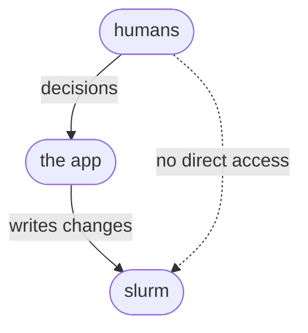
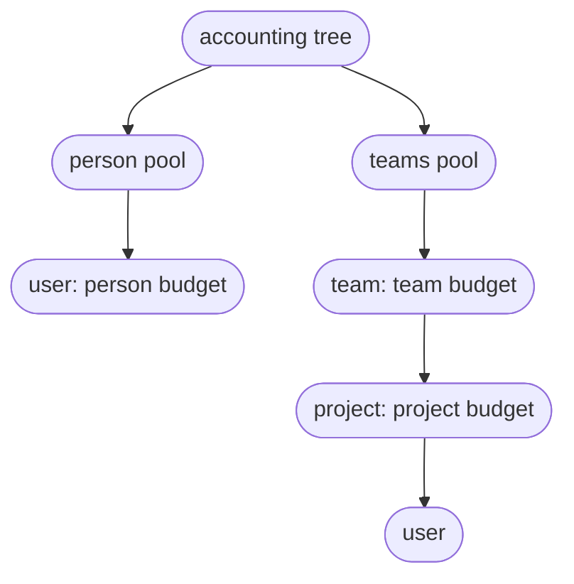
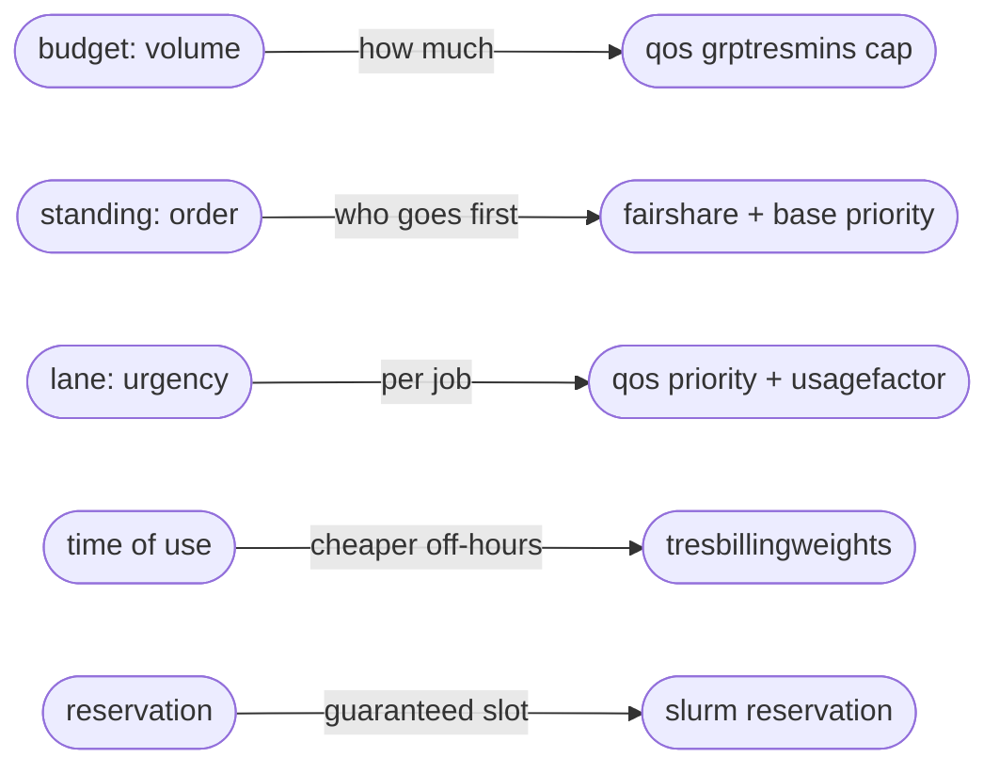

## Stack
The frontend is a React 18 app built with Vite 5, its charts drawn with Recharts and hand-built SVG. There is no build step beyond Vite, no CSS framework, and no test runner.

## Config files
- `frontend/package.json` holds the dependencies and three scripts: `dev`, `build` and `preview`.
- `frontend/vite.config.js` is the only build customisation. It sets `base: '/faircenter/'` so asset URLs resolve under the GitHub Pages project path, `https://stephenwhitmarsh.github.io/faircenter/`. If the repository is renamed, change `base` here.
- `frontend/index.html` is the page shell: the `#root` mount point and the module entry.
- `frontend/src/main.jsx` mounts `<App/>` into `#root`.
- `.gitignore` ignores `node_modules/`, `dist/`, `_to_delete/`, and Vite's `vite.config.js.timestamp-*.mjs` reload artifacts.

## Run and build locally
Work in the `frontend` directory.

```bash
npm install     # once
npm run dev     # dev server with hot reload
npm run build   # production build into frontend/dist
npm run preview # serve the built dist locally
```

The dev server serves at the root and ignores `base`. The production build applies it.

## Deploy to GitHub Pages
Every push to `main` builds the site and publishes it, through `.github/workflows/deploy.yml`. The workflow runs `npm ci` and `npm run build` in `frontend`, uploads `frontend/dist` as the Pages artifact, and deploys it. The live demo is at `https://stephenwhitmarsh.github.io/faircenter/`.

To redeploy, push to `main`, or run the workflow by hand from the Actions tab, which also carries a `workflow_dispatch` trigger. Watch the run under Actions. The demo updates once it is green.

Two settings the workflow depends on, set once:
- GitHub Pages enabled with the source set to GitHub Actions (Settings, then Pages).
- A public repository, since Pages on the free plan does not serve private repositories.

## The live system
The proof of concept runs in the browser on synthetic data with a simulated scheduler, so it needs no backend and GitHub Pages can host it. The live system would require a Django service with Django REST Framework over PostgreSQL, and a scheduler adapter, a small module wrapping sacctmgr, scontrol and sacct behind the app's own interface. A scheduled task would refresh effective standing (priority) from recent use and reconciles the Notion import. Django would map users to to Notion, with the roles below as permissions.

### Where the app sits against the scheduler
The cluster runs SLURM, with the app behind an adapter so another scheduler could be substituted later. Only the app's own service account makes scheduler changes. People act through the app without scheduler permissions.

The app extracts data per job. SLURM's accounting database (read with sacct) holds one finalised record per job with its submit, start and end times, GPU allocation, account, user and QOS. The app stores these and derives every curve from them, so the natural resolution is the job event and the load series is irregular. For work still running, whose accounting record is not final until it ends, the app also polls the live queue (squeue/scontrol) on a short interval to capture in-flight allocations. This job-level history also makes forecasting tractable: with arrival times, sizes, durations and lanes per project and person, demand becomes a time series a trained model can predict and tune parameters against, rather than the recent-rate projection the proof of concept shows. On a cluster where SLURM has already been running, the first phase does not start from an empty record: the accounting database still holds the job history. 



### Budgets on the account tree
Every budget is a `GrpTRESMins` limit on one node of SLURM's accounting tree. The tree is built from the Notion memberships (which might need to curation). The person pool is one branch, with each person a user association under it. The teams pool is the other, shaped as a team account, then a project account under it, then the people as user associations under the project. A job is submitted against an account, and that account decides which branch it draws from.



A phase turns a limit on at one level. Person budgets place it on the user associations in the person pool, team budgets on the team accounts, project budgets on the project accounts. SLURM binds a job to the tightest limit anywhere above it, so the limits coexist and the roll-out adds them without moving anything, with `AccountingStorageEnforce=limits` making them bind.

The transition into project budgets is additive. With team budgets on and project budgets off, only the team account carries a limit, so the team total is capped and its projects share that pool freely. Turning project budgets on adds a limit to each project account, sized to fit inside the team's, and the team limit stays where it was as the outer ceiling. Nothing is re-declared and no budget is removed. Switching project budgets off again clears the project limits and leaves the team limit doing the work alone.

### Parameters
- `budget` is the cap on how much a pool or project may consume over a period, in weighted GPU-hours, held as a `GrpTRESMins` limit on the person, project or team entry in the account tree.
- `budget enforcement` is the set of switches that decide where budgets bind: person, team and project, each an independent `GrpTRESMins` cap. They are cumulative and coexist, and the roll-out enables them in turn, team pools before per-project budgets.
- `person pool share` is the fraction of the capacity the cluster offers set aside for the person pool, the rest going to the teams pool. Operations sets it, and it defaults from the roll-out phase, starting large and falling towards a small residual as the roll-out advances. The person pool's size in GPU-hours is this share of capacity, and the teams pool takes the remainder.
- `over-subscription factor` sets how far budgets may be committed against capacity: below 1 holds capacity back, 1 commits to it, above 1 over-commits. A grant is allowed only while `committed demand ≤ capacity × over-subscription factor` over every window. It defaults to 1.05.
- `time-of-use weight` multiplies the cost of running by time of day, for example 1.0 in office hours and 0.5 off-hours.
- `lane priority` is the queue order a lane adds, so a rush job starts sooner and a batch job waits.
- `lane factor` is what that speed costs: the multiplier on how fast the job draws its budget, for example 2.0 for rush, 1.0 for normal, 0.5 for batch.
- `standing` is the relative weight that sets order under contention, held per team; a project inherits its team's standing.
- `age` is the priority a job gains from waiting, rising the longer it sits so that no job waits behind newer arrivals forever, with a scheduler setting controlling how strongly it counts.
- `budget drawn` is how fast a running job consumes its budget: `budget drawn = GPU-hours × time-of-use weight × lane factor`.
- `expected consumption` forecasts end-of-period use from the project's recent rate, capped at its remaining budget. The app flags a project on track to reach its cap before the period ends, with the date it would. In the proof of concept the rate is a smoothed recent average. Later a model trained on past use replaces it.

### The controls, mapped to SLURM
The app presents a handful of controls, several of them combinations of lower-level SLURM settings, so there are more settings underneath than the app exposes. A budget is a ceiling on total use, held as a `GrpTRESMins` limit in GPU-minutes on an entry in the accounting tree. The enforcement switch chooses where that limit sits: on the user's association for a person, the project account for a project, the team account for a team. The limits nest and coexist, and SLURM holds a job to the tightest that applies up the tree, so the roll-out enables them cumulatively. `AccountingStorageEnforce=limits` makes them bind. SLURM carries standing, which decides order under contention, as fairshare with a base account priority. A lane is a QOS carrying both an added priority and a usage factor, so running faster draws the budget down faster. A reservation locks specific GPUs for a window. The app reads actual use back from SLURM accounting (sacct) and applies time-of-use pricing through TRESBillingWeights.



Budget and standing (priority) are independent. An account can have generous standing and a small budget, so it starts quickly but cannot run for long, or little standing and a large budget, so it waits but can run a great deal once it starts. Standing steers the order of the queue. It does not reserve a fixed share of GPUs, and use converges towards the standing ratios only while everyone is competing, so a standing that works out to forty percent is a tendency under demand, not a fixed forty percent at any moment.

Two controls move more than one thing at once. A faster lane raises both a job's order and its cost, so a job that jumps the queue spends its budget faster, and the speed pays for itself from the same pool. Time of use moves cost alone: the same work run off-hours draws less budget with no change to its order. A job draws, roughly,

```text
budget drawn = GPU-hours × time-of-use weight × lane factor
```

and its place in the queue is

```text
job priority = account standing + lane priority + age
```

where account standing is what the managers set and lane priority is what the engineer picks.

### Data model
The entities the app stores, beyond what it reads live from the scheduler:

- People, teams and projects, imported from Notion and keyed to the app's own stable identifiers.
- Membership links, a person in a project and a project in a team, effective-dated so the app can rebuild past structure.
- Budgets for the two pools, the teams pool and the person pool, and for each team, project and person within them.
- Proposals and the allocations they become, holding requested and granted quota, start, end, and funding source.
- Reservations, each holding GPUs for a window for a named holder.
- Jobs, one record each from the scheduler's accounting database: submit, start and end time, GPU (TRES) count, owning project and person, and lane. The app derives every load curve from these, and the concurrent GPUs at an instant is the sum over jobs running then, so the series is an irregular step function.
- Usage records read from the scheduler, by account, lane, GPU-hours and time.
- Change requests, each with a type (new project, budget change, standing change), a status, and the approver it is routed to.
- Parameters, the policy values (see [POLICY.md](POLICY.md)), versioned with the date each value took effect, so the app can explain a past decision and read an indicator against the settings in force when it was measured.
- Period indicators, computed and retained per period, so the app can compare performance over time and against parameter changes.

### Robustness in the data model
Reporting relies on being able to rebuild any past state, so the app keeps structure and allocations versioned rather than overwritten. This is the app's own storage, not a SLURM feature. It can use effective-dated rows, where each membership or allocation carries a valid-from and valid-to and a change closes the old row and opens a new one, or an append-only log it derives the current state from. Where a reorganisation leaves something unattached, the app falls back: operations funds a project with no team directly until it is reassigned, and a person with no project has only their personal budget.

### Source of truth and identity
For the proof of concept, the assumption is that Notion holds people, projects, teams and their composition. The app keys everything to its own stable identifiers mapped to Notion records, so a rename or a move updates a link rather than breaking it. Identity comes from Notion where possible, otherwise from a name, email and password matched to the Notion records. Whether projects are defined in the app or in Notion, and whether the app reads Notion through its API or directly, are still open.

### Importing associations
The app is built around three relationships, all imported from Notion.

A person's projects come from workspace membership in Notion, a many-to-many link that imports directly. The same link is what SLURM uses as its account associations, deciding which project budgets a person may charge, so one relation serves both the app and the scheduler. A person's default project sets the account a job charges when none is named.

A person's teams are also many-to-many, since a multi-domain expert can support several teams. How this imports depends on the Notion model. If teams are workspaces in their own right, team membership is a direct relation. If only projects are workspaces, team membership follows the teams that own a person's projects. Where a home or reporting team must be distinguished from project involvement, the app keeps it as a separate single field.

A project's team and funding are single-valued attributes of the project: one owning team, and the pool that funds it. Personal work is not a project. It draws on the person pool and is tracked per person.

Where Notion cannot express a many-to-many relation directly, the app holds the extra links itself, keyed to its own identifiers on top of the Notion records.

### Roles and permissions
In production the four roles (viewer, project lead, team lead and operations) come from the organisation's identity provider. The proof of concept simulates them with the switcher. The app stages every change that reaches the scheduler and applies it explicitly, logging who made it and when, which also versions the parameters.
