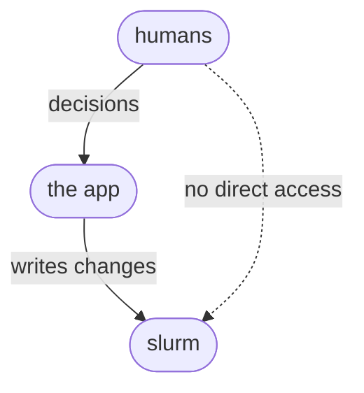

# Manual

## The app, tab by tab
The app is a set of tabs across the top, each with its own audience and job. Which tabs appear depends on the role you are viewing as. The [policy](POLICY.md) sets out the allocation model behind the controls.

A **Viewing as** switcher in the header sets the current role, since the proof of concept has no real sign-in. There are four roles, each with a coloured chip. A viewer sees everything and changes nothing. A project lead plans and books for the projects they run, raising requests and holding their own reservations. A team lead divides their team's pool across its projects and raises requests across the team. Operations sets the policy, sizes the pools, configures the connectors, approves requests, and is the only role that writes to the scheduler. Operations sees every tab and lands on Analytics. The other roles land on My view, and the app hides the operations-only tabs from them.

### My view
A person's own projects and jobs. Tiles across the top count the projects they are on, the GPUs their running jobs hold, how many jobs are queued, and their wait times. The Projects table shows each project's budget, use and budget status, with a role chip marking the ones they lead. Where the project's team is at a phase that does not enforce that budget, the status reads "target only", since the number is a target rather than a cap there. An "Only mine" toggle is on by default. Below, the Jobs table lists what is running and queued, with wait times per lane when priced lanes are on.

### Team
For team leads and operations. Operations see a Policy card that sets the roll-out phase for this one team, ahead of or behind the organisation default, with the mechanisms it turns on shown as chips. Operations also see a Team pool card that sizes this team's pool within the total the teams share. The team lead sees Distribution across projects, splitting the pool across active projects, each allocation capped so the running total never exceeds the pool. Every change here is staged and applied explicitly.

### Queue
The live picture of jobs waiting to run and the order they will run in, which is what the allocation policies shape. Where cross-team standing is on, the ordering reflects each team's standing.

### Load
The load on the cluster over time, built from individual jobs the way it comes from the scheduler, so the band steps up and down as jobs start and finish. It stacks by team, can be scoped, carries the reservations that hold GPUs for set windows, and forecasts each project's future draw against a dashed capacity line, with a strip below the chart to pan and zoom. Beneath it, the Projects table groups each team's projects, with a final Personal group, and shows a use-of-budget meter for each.

### Projects
The register of team projects, one row each with its team, start, budget, consumed, a pace bar against an even spend, and a budget outlook. As in My view, a project whose team does not enforce project budgets reads "target only". Viewers get an "Only mine" default, and a toggle folds finished projects in. Selecting a row opens the full record: the leads to contact, the members, and the recent jobs.

### Budgets
The two pools and how they are divided. A bar at the top shows committed budgets against the capacity the cluster offers over the period, with an uncommitted tail below full or an over-committed overflow past it. The Team pools section lists each team's share, with its phase where that differs from the default, and the projects inside each. The Person pool section shows each person's equal allowance, their use against it, and the gap.

### Directory
People, teams and projects as imported from Notion, browsable by person, team or project. This is where operations checks the imported structure against Notion and keeps it in step.

### Requests
A short form raises a change: a new project, a change to a project's or a team's budget, a priority change, an extension, or a reservation. Each type routes to the right approver, and a person sees an approve or decline control only on the requests that are theirs. The board shows only the people involved. A planner charts the demand that granting the pending requests would add on top of the forecast baseline, against capacity, so a request that would push demand past the hardware shows before approval.

### Analytics
For operations and direction. The operations overview sits at the top: the operational tiles and a short list of what needs attention. Below, the app computes the longer-run indicators per period from the jobs themselves and charts them past and forecast over a configurable horizon, with policy changes marked on the trend. A resource outlook frames the acquisition decision, setting realised demand and committed entitlement against capacity, with a runway to the threshold.

### Policy
Operations only: the mechanisms and values that drive allocation. The mechanisms are switches for whether budgets are enforced at the person, project and team level, whether priced lanes and time-of-use weighting apply, and whether teams carry standing between one another. The values are the numbers behind them: the person pool's share of capacity, the over-subscription factor, the lane prices, and the priority weights. Selecting a roll-out phase loads its preset, which operations can then adjust. Changes stay staged and take effect only on apply, when the app writes them to the scheduler and shows the commands.

### Connectors
Operations only: the systems the app reads from and writes to. SLURM is the scheduler it reads use from and writes budgets and reservations to. Notion supplies people and projects. Slack carries approvals, reminders and budget alerts, with email as a fallback. Single sign-on supplies identity, and object storage holds exports. Operations enables and configures each here.

## Technical notes
The scheduler mapping and the implementation detail behind the sections above, for whoever builds and operates the system.

### Where the app sits against the scheduler
The cluster runs SLURM, with the app behind an adapter so another scheduler could be substituted later. Only the app's own service account makes scheduler changes. People act through the app and never hold scheduler permissions.

The app extracts data per job. SLURM's accounting database (read with sacct) holds one finalised record per job with its submit, start and end times, GPU allocation, account, user and QOS. The app stores these and derives every curve from them, so the natural resolution is the job event and the load series is irregular. For work still running, whose accounting record is not final until it ends, the app also polls the live queue (squeue/scontrol) on a short interval to capture in-flight allocations. This job-level history also makes forecasting tractable: with arrival times, sizes, durations and lanes per project and person, demand becomes a time series a trained model can predict and tune parameters against, rather than the recent-rate projection the proof of concept shows.

On a cluster where SLURM has already been running, the first phase does not start from an empty record: the accounting database still holds the same job history. The site's `PurgeJobAfter` in `slurmdbd.conf` sets how far back it reaches. Where purging was never configured, SLURM keeps individual job records indefinitely, often for the life of the cluster. Where it is set, SLURM removes records older than the window, but only after rolling them up into per-association usage aggregates (hourly, then daily, then monthly, the tables `sreport` reads), and usually keeps those rollups far longer. So the fine-grained job stream stays available for at least the retention window and often since the cluster was commissioned, and the coarse usage picture, GPU-hours by account, user and period, reaches back further still. Two conditions gate this: accounting must have been enabled (a `slurmdbd` with `AccountingStorageType=accounting_storage/slurmdbd`, not `accounting_storage/none`), and GPU detail requires `gres/gpu` in `AccountingStorageTRES`, since jobs recorded before GPUs were tracked as a TRES carry no GPU count. So the shared picture and the first budget sizing can draw on real history from day one rather than waiting a period to accumulate it.

### Data model
The entities the app stores, beyond what it reads live from the scheduler:

- People, teams and projects, imported from Notion and keyed to the app's own stable identifiers.
- Membership links, a person in a project and a project in a team, effective-dated so the app can rebuild past structure.
- Budgets for the two pools, the teams pool and the person pool, and for each team, project and person within them.
- Proposals and the allocations they become, holding requested and granted quota, start, end, priority tier, and funding source.
- Reservations, each holding GPUs for a window for a named holder.
- Jobs, one record each from the scheduler's accounting database: submit, start and end time, GPU (TRES) count, owning project and person, and lane. The app derives every load curve from these, and the concurrent GPUs at an instant is the sum over jobs running then, so the series is an irregular step function.
- Usage records read from the scheduler, by account, lane, GPU-hours and time.
- Change requests, each with a type (new project, budget change, priority change), a status, and the approver it is routed to.
- Parameters, the policy values (see [POLICY.md](POLICY.md)), versioned with the date each value took effect, so the app can explain a past decision and read an indicator against the settings in force when it was measured.
- Period indicators, computed and retained per period, so the app can compare performance over time and against parameter changes.

### Robustness in the data model
Reporting relies on being able to rebuild any past state, so the app keeps structure and allocations versioned rather than overwritten. This is the app's own storage, not a SLURM feature. It can use effective-dated rows, where each membership or allocation carries a valid-from and valid-to and a change closes the old row and opens a new one, or an append-only log it derives the current state from. Where a reorganisation leaves something unattached, the app falls back: operations funds a project with no team directly until it is reassigned, and a person with no project has only their personal budget.

### Source of truth and identity
For the proof of concept, Notion holds people, projects, teams and their composition. The app keys everything to its own stable identifiers mapped to Notion records, so a rename or a move updates a link rather than breaking it. Identity comes from Notion where possible, otherwise from a name, email and password matched to the Notion records. Whether projects are defined in the app or in Notion, and whether the app reads Notion through its API or directly, are still open.

### Roles and permissions
In production the four roles come from the organisation's identity provider. The proof of concept simulates them with the switcher. The app stages every change that reaches the scheduler and applies it explicitly, logging who made it and when, which also versions the parameters.

### Importing associations
The app is built around three relationships, all imported from Notion.

A person's projects come from workspace membership in Notion, a many-to-many link that imports directly. The same link is what SLURM uses as its account associations, deciding which project budgets a person may charge, so one relation serves both the app and the scheduler. A person's default project sets the account a job charges when none is named.

A person's teams are also many-to-many, since a multi-domain expert can support several teams. How this imports depends on the Notion model. If teams are workspaces in their own right, team membership is a direct relation. If only projects are workspaces, team membership follows the teams that own a person's projects. Where a home or reporting team must be distinguished from project involvement, the app keeps it as a separate single field.

A project's team and funding are single-valued attributes of the project: one owning team, and the pool that funds it. Personal work is not a project. It draws on the person pool and is tracked per person.

Where Notion cannot express a many-to-many relation directly, the app holds the extra links itself, keyed to its own identifiers on top of the Notion records.

### Tools and software
The proof of concept runs entirely in the browser. The README covers its stack. The live system adds a backend the demo does not need: Django with Django REST Framework over PostgreSQL, and a scheduler adapter, a small module wrapping sacctmgr, scontrol and sacct behind the app's own interface, for which the proof of concept's simulator stands in. A scheduled task refreshes effective standing from recent use and reconciles the Notion import. Django's own users carry authentication mapped to Notion, with the roles above as permissions.

Hosting follows the same split. GitHub Pages hosts the static demo, since the synthetic data and simulated scheduler run in the browser. The live backend has to reach SLURM and Notion, so it runs on a machine near the cluster, most likely an ICM-hosted server, serving the front end from there or from Pages against that backend.
