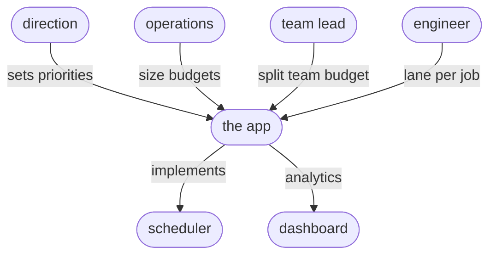

# Policy

## Organisation

### Teams, projects and budgets
The principle is that faircenter helps organise work into teams and projects (optionally), and maps resources to the people, teams and projects. People can belong to one or multiple teams, and work on one or multiple projects.

The cluster's GPU time is divided into two pools: a person pool and a teams pool. The person pool allows individuals to do exploratory work and does not draw a team's budget. A project draws from its team pool. A team pool might be divided across its projects, or kept as a single pool. A team budget renews and a project budget is dated. A team's pool is a recurring allowance that resets each period, so a team plans against a steady share. It can ask for augmentation when that share runs too small. A project's budget has a deadline, which can be extended when the work needs longer.

### Roles
Roles are allocated to people, and these can be temporary, or long term. Roles determine which requests can be made or approved, and which policy values can be set. E.g., a team leader can distribute their team budget pool across projects, while operations can distribute the total capacity between teams (and persons). Team leadership can be held, shared, left empty, or reassigned. If empty, decisions are deferred to operations.

### Priorities
Resource allocation is managed in two ways: budget and priority (standing). The proposed policy is that personal budgets are of the lowest priority. They have no guaranteed capacity, but can use a certain budget over time. Team budgets similarly have a set pool, but come with the ability to commit a job in a low, medium or high priority lane. Priority comes with a cost of burning through more budget. Team jobs always have priority over personal jobs. If the team leader decides to do so, they can enable project budgets within their team, allowing them to distribute their total budget across the projects, ensuring sufficient resources for certain higher priority projects. Finally, teams can be ranked in priority, determined by management, and implemented by operations.

### Allocation and reservations
faircenter provides a tab to request new projects, or changes in budget or priority, which are forwarded for approval. GPUs can also be reserved. However this blocks them for any other('s) use, so is planned with the help of a view on load and planned capacity.

## Units
A GPU is one accelerator, a headcount. A GPU-hour is one GPU running for one hour: a volume of work. The two convert through time, GPU-hours = GPUs × hours. Pools, team allowances and capacity are shares of the cluster, so the app shows them as GPUs: a team allowance of two hundred GPUs holds that many of the cluster's GPUs on average, and the person and team pools add up to the cluster's headcount. A project budget is different, an amount of compute a dated piece of work may spend, so it is GPU-hours over that project's own start-to-end. Utilisation is GPU-hours used over GPU-hours offered across a window, the same ratio as average GPUs in use over GPUs installed, so it carries no unit.

## Mechanisms
The policy is implemented in a small set of transparent mechanisms that determine how the limited GPU resources can be used. As described in the [strategy](STRATEGY.md), a gradual "switching on" of these mechanisms, and their fine-tuning, will align GPU usage fairly, and according to the organisational priorities.

- Person budgets: cap each person at their budget
- Team budgets: cap each team pool
- Project budgets: cap each project at its budget
- Priced urgency (lanes): fast and bulk lanes available to jobs
- Time-of-use weighting: office/off-hours weight on budget drawn
- Team priority: team-level priority in the queue

## Parameters
Parameters allow fine-tuning and setting optimal use:

- % share of capacity for individual work; the rest is the team pools
- % capacity that may be committed as budgets
- The weights and costs of priority lanes
- The reduced costs for off-hour usage