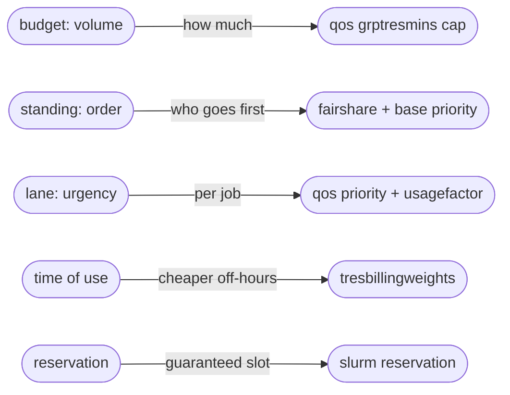

# Policy

## Teams, projects and budgets
faircenter organises work into teams, which hold projects, which people run. Teams change over time, splitting and merging, so the project is the stable unit the system is built on. A project keeps its own identity, budget and history even as the teams around it change.

The cluster's GPU time divides into two pools, the teams pool and the person pool. The teams pool holds a pool for each team, which the team divides across its projects. Every funded project belongs to a team. The person pool is separate. It gives each person a small allowance for individual, exploratory work and draws on no team's budget. A project draws only on the pool that funds it. A team budget renews and a project budget is dated. A team's pool is a recurring allowance that resets each period, so a team plans against a steady share and asks for augmentation when that share runs too small. A project's budget is a one-shot quota with a deadline, drawn down once and closed when the work ends or the date passes, and extended when the work needs longer. Both are volumes of GPU-time bounded by the pool that funds them, and both run out. Only standing, which sets order rather than volume, never runs out.

Operations sets the split with one number in the Policy view: the person pool's share of the capacity the cluster offers. Keeping it separate shows the balance between individual and team work at a glance, and lets operations move that one number without touching any team's budget. The person pool starts large. Operations moves its share into the teams pool as the organisation matures, lowering it phase by phase, and as sustained personal work becomes a project and leaves the pool.

Person work is self-service. The person pool is a best-effort share with no guaranteed capacity, so personal work holds no reservation and needs no approval. It takes what the pool's fair share allows, scheduled fairly among the people using it. Reservations and budget approvals need governance because they remove capacity from others. This also sets the incentive to formalise a sustained need into a project, where it can earn a reservation and a guaranteed share. Team leaders do not fund or track their people's personal work. Operations sizes the person pool, and the app reports it by team only for attribution, so a team leaning heavily on it shows work that has not yet formalised.


A team project belongs to a home team, for the org chart and for who works on it, and that team's pool funds it. Individual work is the exception: it is not a project, and draws on the person pool.

Team leadership can be held, shared, left empty, or reassigned. Where a team has no leader, operations makes its allocation decisions from the team's pool. A team gets its own pool to divide only once it is stable enough to warrant it.

## Who decides what
Direction sets the priorities that say what matters most, held as each team's standing. Operations sizes the budgets, a question of capacity and cost. A team leader divides the team's budget across its projects. An engineer chooses the lane for each job within the budget granted. Standing is a team property: a project takes its team's standing, and a team settles what matters most among its own projects through how it splits its budget. Arbitration between teams follows the budget shares through SLURM's fair-tree. The design drops absolute priority numbers, which would be false precision and would not, on their own, move work across teams. Each decision sits with whoever holds the relevant information, and direction and operations can each ask the other to change priorities, one proposing and the other confirming.


## Requests and allocation
A project gets its budget by proposal. The proposal names a maximum budget, a start, and a deadline or duration. A change to a project's budget or an extension goes to the team leader, who allocates from the team's pool. A new project, and a change to a team's whole pool, go to operations. Each approver handles a proposal as it arrives, rather than gathering them to a date.

Once a project has a budget, an engineer submits jobs against it and picks a lane for each. The scheduler decides when a job runs, the job executes on the hardware, and its use draws the budget down. Usage and a periodic review go back to the managers, who adjust priorities and budgets over time. Individual jobs and lane choices need no approval: the scheduler shares fairly, and the lane is already paid for out of the project's own budget. Only budgets and priorities need approval. Personal work skips this flow, running best-effort within the person pool with no proposal, approval or reservation.


## The controls, mapped to SLURM
The app presents a handful of controls, several of them combinations of lower-level SLURM settings, so there are more settings underneath than the app exposes. A budget is a ceiling on total use, held as a `GrpTRESMins` limit in GPU-minutes on an entry in the accounting tree. The enforcement switch chooses where that limit sits: on the user's association for a person, the project account for a project, the team account for a team. The limits nest and coexist, and SLURM holds a job to the tightest that applies up the tree, so the roll-out enables them cumulatively. `AccountingStorageEnforce=limits` makes them bind. SLURM carries standing, which decides order under contention, as fairshare with a base account priority. A lane is a QOS carrying both an added priority and a usage factor, so running faster draws the budget down faster. A reservation locks specific GPUs for a window. The app reads actual use back from SLURM accounting (sacct) and applies time-of-use pricing through TRESBillingWeights.



Budget and standing are independent. An account can have generous standing and a small budget, so it starts quickly but cannot run for long, or little standing and a large budget, so it waits but can run a great deal once it starts. Standing steers the order of the queue. It does not reserve a fixed share of GPUs, and use converges towards the standing ratios only while everyone is competing, so a standing that works out to forty percent is a tendency under demand, not a fixed forty percent at any moment.

Two controls move more than one thing at once. A faster lane raises both a job's order and its cost, so a job that jumps the queue spends its budget faster, and the speed pays for itself from the same pool. Time of use moves cost alone: the same work run off-hours draws less budget with no change to its order. A job draws, roughly,

```text
budget drawn = GPU-hours × time-of-use weight × lane factor
```

and its place in the queue is

```text
job priority = account standing + lane priority + age
```

where account standing is what the managers set and lane priority is what the engineer picks. A single weight caps how far the lane term can lift a job above the standing the managers have set, so an engineer can reorder their own work without overturning the organisation's priorities.

## Priced urgency
Budget is one quantity, weighted GPU-time, and two settings change how fast a job spends it. Time of use makes off-hours cheaper, and a faster lane costs more per GPU-hour. Together they let a small urgent project afford the fast lane while a large one runs most of its work at normal priority. In SLURM the lanes are QOSes: a rush lane with high priority and a usage factor of two, a normal lane at one, and a batch lane with low priority and a usage factor of a half, all drawing on the same budget. The proof of concept can set every factor to one, so priority and budget stay visibly separate until pricing starts.

## Standing across the hierarchy
Standing is held per team, and a project inherits its team's standing, so all of a team's projects sit at one position against other teams. The app carries each team's standing on the team account and lets SLURM's fairshare order the queue by it under contention. Within a team, projects are separated by their budgets and by job age, not by a priority of their own; a team settles what matters most among its projects through how it splits its budget. The app refreshes standing periodically from recent use, so a team that has been idle rises in the queue. The account tree holds the budgets and gathers usage for reporting. A weight governs how far an engineer's lane choice can move a job ahead of the standing the managers have set.

## Admission and availability
faircenter counts every budget against the hardware that exists. The GPU-hours the cluster offers over a period are the ceiling. One control, the over-subscription factor, sets how far budgets can commit against it: below one holds capacity back, at one commits the full amount, above one over-commits on purpose, since projects rarely peak together and the scheduler absorbs the rest. The app refuses a grant that would push committed budgets past the limit,

```text
committed budgets  ≤  capacity × over-subscription factor
```

so it can answer at any time whether the resources a project needs will be there. Holding capacity back leaves no GPUs idle: a budget is an entitlement, and the held-back share is a figure in the account tree while the machines behind it run other work.

A proposal's budget, spread over its window, gives an expected demand curve, flat by default, so average concurrent demand is the budget divided by the duration. Real training loads rise towards a deadline, so once a project is running the app trusts its actual use and remaining budget over the estimate. Summed across projects, committed demand over any overlapping window must stay within the same limit. The factor starts near one and can rise once real use shows how fully projects consume their budgets. Committed budgets run for the life of the project, not re-cut each cycle. Direction can reduce a running budget for more urgent work, a rare manual step.

## Parameters
Every tunable value the app holds. Only operations can edit them, and everyone can see them, in the Policy view. Operations keeps the dated capacity schedule on the Load view. Edits stay staged and reach the scheduler only on an explicit apply.

- `budget` is the cap on how much a pool or project may consume over a period, in weighted GPU-hours, held as a `GrpTRESMins` limit on the person, project or team entry in the account tree.
- `budget enforcement` is the set of switches that decide where budgets bind: person, team and project, each an independent `GrpTRESMins` cap. They are cumulative and coexist, and the roll-out enables them in turn, team pools before per-project budgets.
- `person pool share` is the fraction of the capacity the cluster offers set aside for the person pool, the rest going to the teams pool. Operations sets it, and it defaults from the roll-out phase, starting large and falling towards a small residual as the roll-out advances. The person pool's size in GPU-hours is this share of capacity, and the teams pool takes the remainder.
- `over-subscription factor` sets how far budgets may be committed against capacity: below 1 holds capacity back, 1 commits to it, above 1 over-commits. A grant is allowed only while `committed demand ≤ capacity × over-subscription factor` over every window. It defaults to 1.05.
- `time-of-use weight` multiplies the cost of running by time of day, for example 1.0 in office hours and 0.5 off-hours.
- `lane priority` is the queue order a lane adds, so a rush job starts sooner and a batch job waits.
- `lane factor` is what that speed costs: the multiplier on how fast the job draws its budget, for example 2.0 for rush, 1.0 for normal, 0.5 for batch.
- `standing` is the relative weight that sets order under contention, held per team; a project inherits its team's standing.
- `account-vs-lane weight` caps how far a lane can lift a job above account standing, in `job priority = account standing + account-vs-lane weight × lane priority + age`.
- `age` is the priority a job gains from waiting, rising the longer it sits so that no job waits behind newer arrivals forever, with a scheduler setting controlling how strongly it counts.
- `budget drawn` is how fast a running job consumes its budget: `budget drawn = GPU-hours × time-of-use weight × lane factor`.
- `expected consumption` forecasts end-of-period use from the project's recent rate, capped at its remaining budget. The app flags a project on track to reach its cap before the period ends, with the date it would. In the proof of concept the rate is a smoothed recent average. Later a model trained on past use replaces it.
