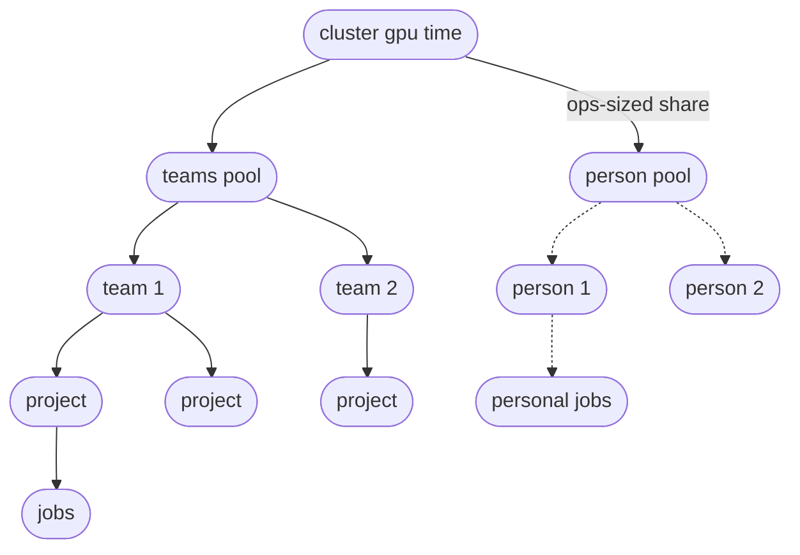
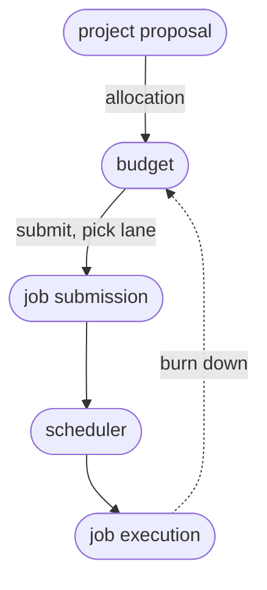
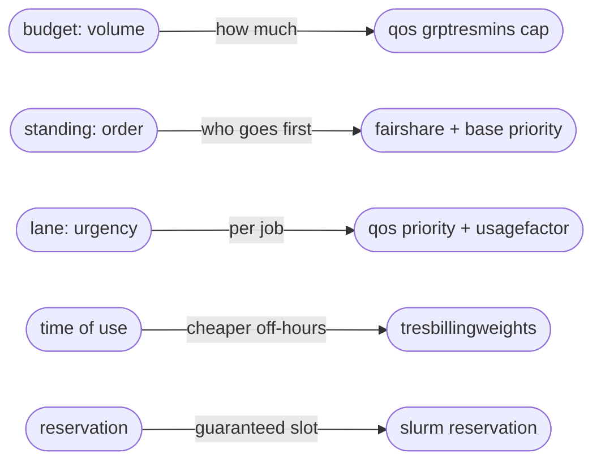

# Policy

## Organization

### Teams, projects and budgets
The principles is that faircenter helps organize work into teams and projects (optionally), and maps resources to the people, teams and projects. People can belong to one or multiple teams, and work on one or multiple projects.

The cluster's GPU time is divided into two pools: a persons pool and teams pool. The person pool allows individuals to do exploratory work and does not draws a team's budget. A project draws only on the pool that funds it. A teams pool might be divided across its projects, or kept as a single pool.  A team budget renews and a project budget is dated. A team's pool is a recurring allowance that resets each period, so a team plans against a steady share. It can ask for augmentation when that share runs too small. A project's budget has a deadline, which can be extended when the work needs longer.



### Roles
Roles are allocated to people, and these can be temporary, or long term. Roles determine which requests can be made or approved, and which policy values can be set. E.g., a team leader can distribute their team budget pool across projects, while operations can distribute the total capacity between teams (and persons). Team leadership can be held, shared, left empty, or reassigned. If empty, decisions are deferred to operations.

### Priorities
Resource allocation is managed in two ways: budget and priority (standing). The proposed policy is that personal budgets are of the lowest priority. They have no guareteed capacity, but can use a certain budget over time. Team budgets similarly have a set pool, but come with the ability to commit a job in a low, medium or high priority lane. Prioritiy comes with a cost of burning through more budget. Team jobs always have priority over personal jobs. If the team leader decides to do so, they can enable project budgets within their team, allowing them to distribute their total budget across the projects, ensuring sufficient resources for certain higher priority projects. Finally, teams can be ranged in priority, determined by management, and implemented by operations. 


### Allocation and reservations
fairsharing provides a tab to request new projects, or changes in budget or priority, which are forwarded for approval. GPUs can also be reserved. However this blocks them for any other('s) use, so is planned with the help of a view on load and planned capacity.




## Mechanisms
The policy is implemented in a small set of transparent mechanisms that determine how the limited GPU resources can be used. As described in the [strategy](STRATEGY.md), a gradually "switching on" of these mechanisms, and their fine-tuning, will align GPU usage fairly, and according to the organizational priorities.

- Person budgets: cap each person at their budget	
- Team budgets:	cap each team pool	
- Project budgets:	cap each project at its budget	
- Priced urgency (lanes): fast and bulk lanes available to jobs	
- Time-of-use weighting: office/off-hours weight on budget drawn	
- Team priority: team-level priority in the queue

## Parameters
Parameters allow fine-tuning and setting optimal use:

- % share of capacity for individual work; the rest is the team pools
- % capacity that may be committed as budgets
- The weights and costs of priority lanes
- The reduced costs for off-hour usage 


[The following should be integrated into BUILD.md and removed here:]


- `budget` is the cap on how much a pool or project may consume over a period, in weighted GPU-hours, held as a `GrpTRESMins` limit on the person, project or team entry in the account tree.
- `budget enforcement` is the set of switches that decide where budgets bind: person, team and project, each an independent `GrpTRESMins` cap. They are cumulative and coexist, and the roll-out enables them in turn, team pools before per-project budgets.
- `person pool share` is the fraction of the capacity the cluster offers set aside for the person pool, the rest going to the teams pool. Operations sets it, and it defaults from the roll-out phase, starting large and falling towards a small residual as the roll-out advances. The person pool's size in GPU-hours is this share of capacity, and the teams pool takes the remainder.
- `over-subscription factor` sets how far budgets may be committed against capacity: below 1 holds capacity back, 1 commits to it, above 1 over-commits. A grant is allowed only while `committed demand ≤ capacity × over-subscription factor` over every window. It defaults to 1.05.
- `time-of-use weight` multiplies the cost of running by time of day, for example 1.0 in office hours and 0.5 off-hours.
- `lane priority` is the queue order a lane adds, so a rush job starts sooner and a batch job waits.
- `lane factor` is what that speed costs: the multiplier on how fast the job draws its budget, for example 2.0 for rush, 1.0 for normal, 0.5 for batch.
- `standing` is the relative weight that sets order under contention, held per team; a project inherits its team's standing.
- `account-vs-lane weight` caps how far a lane can lift a job above account standing, in `job priority = account standing + account-vs-lane weight × lane priority + age`.
- `age` is the priority a job gains from waiting, rising the longer it sits so that no job waits behind newer arrivals forever, with a scheduler setting controlling how strongly it counts.
- `budget drawn` is how fast a running job consumes its budget: `budget drawn = GPU-hours × time-of-use weight × lane factor`.
- `expected consumption` forecasts end-of-period use from the project's recent rate, capped at its remaining budget. The app flags a project on track to reach its cap before the period ends, with the date it would. In the proof of concept the rate is a smoothed recent average. Later a model trained on past use replaces it.


## The controls, mapped to SLURM
The app presents a handful of controls, several of them combinations of lower-level SLURM settings, so there are more settings underneath than the app exposes. A budget is a ceiling on total use, held as a `GrpTRESMins` limit in GPU-minutes on an entry in the accounting tree. The enforcement switch chooses where that limit sits: on the user's association for a person, the project account for a project, the team account for a team. The limits nest and coexist, and SLURM holds a job to the tightest that applies up the tree, so the roll-out enables them cumulatively. `AccountingStorageEnforce=limits` makes them bind. SLURM carries standing, which decides order under contention, as fairshare with a base account priority. A lane is a QOS carrying both an added priority and a usage factor, so running faster draws the budget down faster. A reservation locks specific GPUs for a window. The app reads actual use back from SLURM accounting (sacct) and applies time-of-use pricing through TRESBillingWeights.



Budget and standing are independent. An account can have generous standing and a small budget, so it starts quickly but cannot run for long, or little standing and a large budget, so it waits but can run a great deal once it starts. Standing steers the order of the queue. It does not reserve a fixed share of GPUs, and use converges towards the standing ratios only while everyone is competing, so a standing that works out to forty percent is a tendency under demand, not a fixed forty percent at any moment.

Two controls move more than one thing at once. A faster lane raises both a job's order and its cost, so a job that jumps the queue spends its budget faster, and the speed pays for itself from the same pool. Time of use moves cost alone: the same work run off-hours draws less budget with no change to its order. A job draws, roughly,

```text
budget drawn = GPU-hours × time-of-use weight × lane factor
```

and its place in the queue is

```text
job priority = account standing + lane priority + age
```

where account standing is what the managers set and lane priority is what the engineer picks. A single weight caps how far the lane term can lift a job above the standing the managers have set, so an engineer can reorder their own work without overturning the organisation's priorities.
