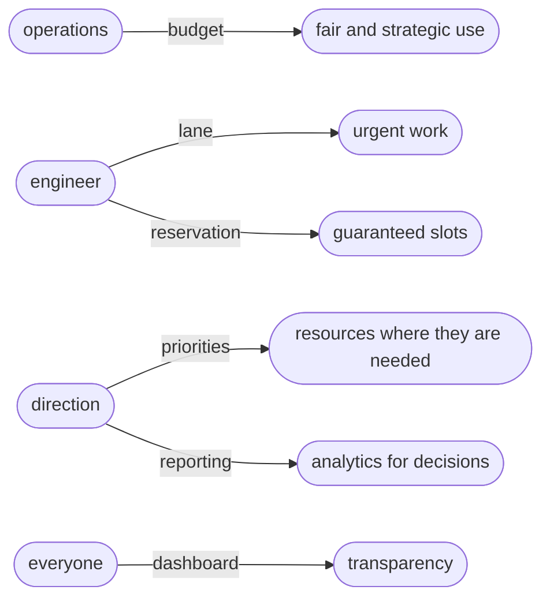
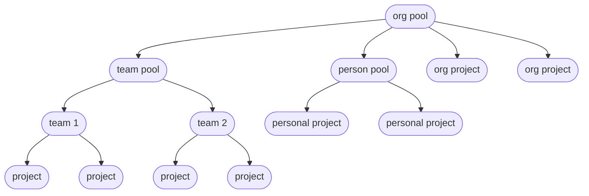
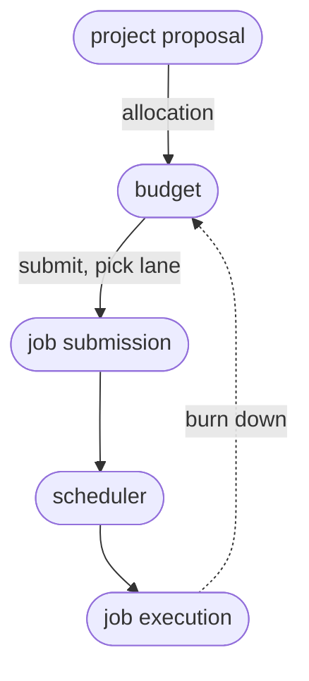
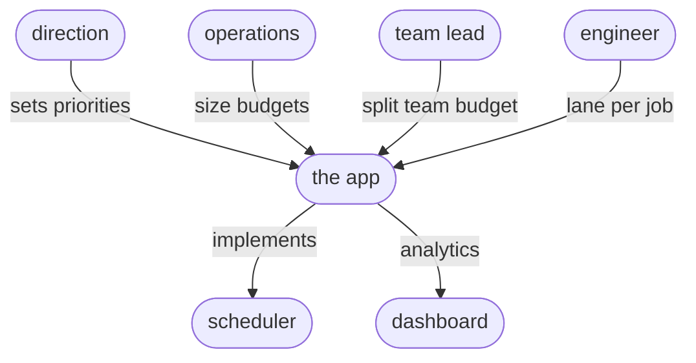
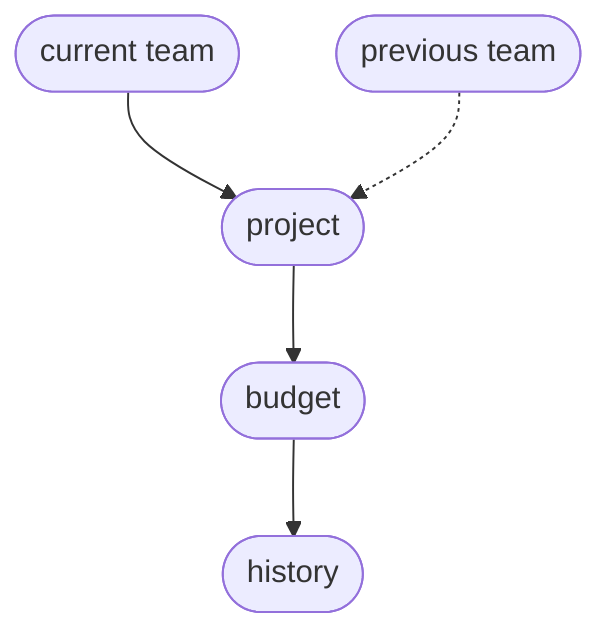
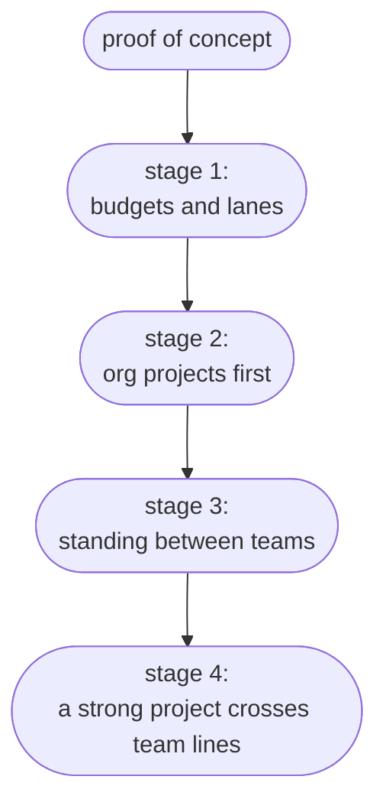
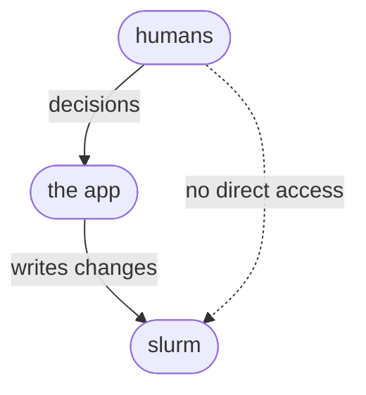
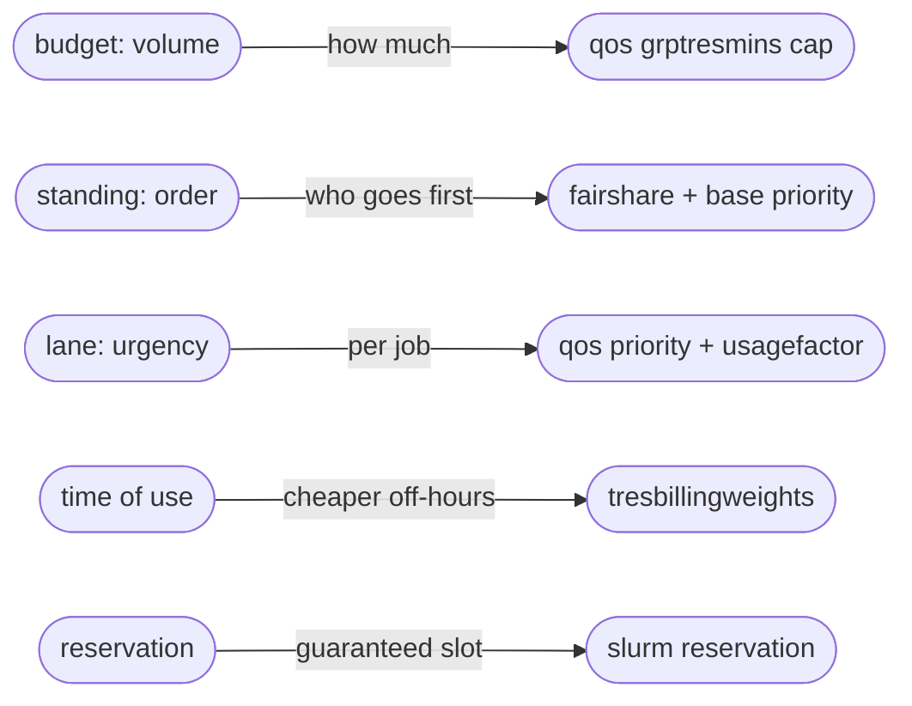

# GPU Allocation Model
A proposal for sharing GPU time across the organisation with clear budgets, visible use, and decisions that direction and managers can stand behind. The main sections are written for direction and operational management. The technical detail is gathered into an appendix at the end.

## The problem today
There are no allocation policies, no shared view of who is using the cluster, and no governance around it. Raw usage can be read after the fact, but nothing turns it into a picture the organisation can act on. The cost shows up at every level:

- Nothing decides who should get what, so access is first come first served.
- Direction cannot see where resources go, so priorities rest on impression rather than evidence.
- A project cannot tell in advance whether the resources it needs will be free.
- There is no record of what was granted or used, so nothing can be traced.
- Demand cannot be weighed against the hardware that exists.
- With none of this visible, people over-ask, hold on to more than they need, or work around the queue, and the cluster can run flat out while serving the wrong work.

## What the app does
The app sits between what the organisation wants and what the cluster does. People and projects come from Notion, direction sets priorities, and engineers submit proposals. The app turns these into budgets and priorities, applies them in the scheduler that runs the jobs, and reports use back out. Each control closes one of the gaps above. Every row shows who holds a control, the mechanism they use, and what it delivers.



### Fair and strategic use
Operations gives each team, project and person a budget, a share of GPU time over a period. Use is fair because everyone works within a known allowance, and strategic because the size of each budget reflects what the organisation has chosen to back.

### Urgent work
How much compute a project needs and how quickly it must run are separate questions. An engineer picks a lane for each job, and a faster lane costs more of the project's budget, so urgent work can move ahead when it needs to while routine work runs at normal cost.

### Guaranteed slots
Where a piece of work must run at a set time, a reservation holds GPUs for it. Reservations are granted only where a guarantee is needed, because reserved time that goes unused is lost.

### Resources where they are needed
Direction sets priorities that decide who wins when the cluster is busy. Raising a project's or team's priority moves its work up the queue without changing how much it can use in total.

### Transparency
A dashboard shows everyone the same picture of budgets, actual use, and what is reserved. The allocation rules are open as well: the priority and budget each project holds, the parameters behind them, and how they are put into effect in the scheduler. Anyone can see why one project is resourced ahead of another, which replaces guesswork and rebuilds trust in the queue.

### Analytics for decisions
Usage and requests are gathered into reports that show direction where demand is rising and whether the hardware matches it. This is the evidence for the next investment.

## Teams, projects and budgets
Work is organised as teams, which hold projects, which are run by people. Teams are created, split and merged over time, so the project is the stable thing the system is built around. A project keeps its own identity, budget and history even as the teams around it change.

The whole of the cluster's GPU time is the org pool, and everything else is a division of it. It is split into a team pool for each team, which the team divides across its projects, and a person pool that gives each person a small allowance for individual work. The organisation also funds some projects directly from the org pool when they matter beyond any single team. Each level keeps part of its share back as headroom, and a project draws only on the pool that funds it.



A project belongs to a home team for the org chart and for who works on it, and it is funded either from that team's pool or from the organisation's pool. Keeping those two things apart lets both funding routes exist without disturbing the chart.

Team leadership is a role that can be held, shared, left empty, or reassigned. Where a team has no leader, the operational manager makes its allocation decisions, or the team's projects are funded from the organisation's pool. A team is given its own budget to split only once it is stable enough to warrant it.

## Requests and allocation
A project gets its budget by proposal. The proposal names a maximum budget, a start, and a deadline or duration, and it goes either to the team leader, who allocates from the team's pool, or to the managers, who fund it from the organisation's pool. Proposals are handled as they arrive rather than gathered to a date.

Once a project has a budget, an engineer submits jobs against it and picks a lane for each one. The scheduler decides when a job runs, the job then executes on the hardware, and its use draws the budget down. Usage and a periodic review go back to the managers, who adjust priorities and budgets over time. Individual jobs and lane choices need no approval, because the scheduler shares fairly and the lane is already paid for out of the project's own budget. Only budgets and priorities are approved.



## Who decides what
Direction sets the priorities that say what matters most at the moment. Operations sizes the budgets, which is a question of capacity and cost. A team leader, where there is one, divides the team's budget across its projects. An engineer chooses the lane for each job, within the budget already granted. Each decision sits with whoever holds the relevant information, and the app carries them into the scheduler. Direction and operations can each ask the other to change priorities, one proposing and the other confirming.



## The app's views
The app is organised into a few views, each with its own audience and job.

### People, teams and projects
People, teams and projects are imported from Notion and administered here. Each project carries its own record: the budget requested and the budget granted, its start and end, and the priority it holds. Budgets are shown in GPU-hours and as a share of the org pool, and the tables sort by any column. Lane is not a project attribute, since it is chosen per job at submission. This is where the imported structure is checked and kept in step with Notion.

### Consumption and reservations
This view shows the load on the cluster over time: each project's consumption stacked into the total, by hour for the current day and by date over longer ranges, and it can be scoped to a team, a project or a person. It carries the reservations that hold GPUs for set windows. Past the current moment the load is forecast from each project's recent rate, capped at the budget it has left, so the forecast tapers as budgets run down. A project on track to exhaust its budget before the period ends is flagged with the date. Expected use is therefore never shown above budget, because the budget is a hard cap that stops a project's jobs once it is reached.

### Policy and parameters
The parameters that drive allocation live here: the lane prices, the time-of-use weights, the priority weights, and the headroom shares. Each mechanism has an on/off switch, and the lanes are listed with the SLURM QOS a job submits with. They are editable only by operations and visible to everyone, so the rules that decide allocation are open to all even though one role sets them. Headroom per team and per project is not approved case by case: it is a single percentage set here and applied automatically at each level when a budget is granted, so an approved budget is already net of the headroom held back.

Alongside the parameters sit the indicators that measure whether they are set well, so the evidence for tuning is next to the settings it informs. They include how long jobs wait before they run, by lane and by time of day; how much of a budget is consumed at the halfway point of a period and at its end, which shows whether budgets are sized and paced sensibly; how often extensions and budget or priority changes are requested, and how often they are granted; how much headroom and reserved time went unused; and the spread of use across projects against the priority each was given.

Each indicator points to a lever. Long waits in a lane point to its price, a period-end scramble to budget sizing, a flood of change requests to budgets set too tight at the start. Because every parameter is versioned with the date it changed, each indicator can be tracked over time and read against the parameters in force when it was measured, so the effect of a change can be seen rather than guessed. A cut in average wait after a lane reprice, or a fall in extension requests after budgets are loosened, shows up next to the setting that caused it.

### Analytics
Longer-run analysis for direction, across periods rather than within one: how utilisation and committed demand are trending month on month against the hardware, and where use concentrates by team. This is the evidence for priority and investment decisions, distinct from the current-period detail in Consumption. The indicators that measure the allocation system itself sit with the parameters they tune, not here.

### Requests for changes
Anyone can ask for a change here: a new project, or a change to a project's budget or priority. Each request is routed to the next person up for approval. If a change would take a pool past its known limits, the app warns before the request is submitted.

## Headroom and knowing what is available
Each level keeps part of its budget as headroom: a share of capacity left ungranted on purpose. The organisation keeps headroom above the teams, and each team and project keeps some of its own. Headroom lets a new project start partway through a period without waiting for another to finish, and it absorbs urgent work when it arrives. It is distinct from what is still free, the room above it that shrinks as budgets are granted. Because a budget is an entitlement and not reserved hardware, headroom holds no GPUs idle: the machines behind it stay busy, and the room it keeps is only in the ledger.

All of it is counted against the hardware that exists. Committed budgets, the headroom at every level, and whatever is still free add up to the real total, and a request that would break that sum is refused. This is what lets the app answer, at any time, whether the resources a project needs will be there.

```text
total capacity  =  committed budgets  +  headroom  +  still free
```

## Risk assessment
The main risks to the scheme, and how the design handles them.

Organisational change is the largest. Staff, projects and teams change often, and a design tied to a fixed org chart would break at the first reorganisation. The project is the durable unit and carries its own budget and history, so moving it between teams changes only where it is reported. Splitting or merging a team re-points which projects belong where and leaves the projects untouched. Roles move between people as reassignments. Because most budget sits with projects and teams rather than individuals, someone leaving does not strand a project, and someone joining draws on their project's budget at once. The stored history that makes past states reconstructable is described in the appendix.



Gaming and hoarding come next, and they are to be expected. In any shared system people act to protect their own work, asking for more than they need or spending a large budget to push their own jobs through. Neither pays off here. A budget is volume, not priority: a large one lets a project run more over the period, but it does not move its jobs up the queue, because order is set by standing, which the managers hold. Standing falls the more an account has used lately, so spending hard to get ahead pushes a project's own later jobs behind lighter users. The only way to turn budget into priority is to pay for a fast lane, which spends the budget faster per unit of work. And because a budget is an entitlement and not reserved hardware, a large unused budget locks nothing away, since the scheduler runs other work on the idle capacity.

Over-asking is caught at the grant, not by watching for unused budget. A budget is a slice of a finite org pool, so a large one is visibly less for everyone else and has to be authorised by someone who sees the whole pool and the priorities. The analytics show each project's share of the cluster against the priority it was given, so a project taking a large share it was never ranked for stands out and can be cut at review.

The factors are visible for a second reason: everyone can see how allocation is decided, which leaves little room for quiet gaming, and the same factors can be set to steer behaviour. A cheaper off-hours `time-of-use weight` moves heavy work to the night, a higher rush `lane factor` discourages casual use of the fast lane, and the published `headroom` shows how much slack the organisation holds.

The other risks are smaller, and each has a clear answer:

- Promising more than exists. Every grant is checked against real capacity with headroom held back, so the totals reconcile to the hardware available (see the appendix).
- Stale organisation data. The app keys to its own stable identifiers and falls back gracefully when a project or person is briefly unattached, so a Notion rename or a mid-reorganisation gap does not break allocation.
- Reliance on one scheduler. The scheduler sits behind an adapter, so SLURM can be replaced without changing the rest.
- Stranded reservations. Reservations are granted only where a guaranteed slot is needed, and idle reserved time is shown so it can be reclaimed.
- Weak adoption. The first stage needs no priority policy and no per-job approval, so the scheme is light to adopt, and the visibility it gives direction is the reason to keep using it.

## Rollout
The scheme is built up in stages, starting with a proof of concept and adding control only where it is needed. Each stage works on its own, and a fast-moving organisation can stay at an early one until it has a reason to move on.



### Proof of concept
The proof of concept runs on invented data and a simulated scheduler, so the whole scheme can be shown without touching the cluster. It models three teams of three people, with two projects per team and two personal projects per person, and shows the three parts together: the dashboard of use, the request and allocation flow, and the governance and priority decisions. It can also run a team split, a merge, and a person moving, with budgets and history surviving intact.

### Stage 1: budgets and lanes
The first live stage uses budgets alone. Every team, project and person has a budget, engineers pick lanes for urgent work, and the dashboard shows use. Priority is flat, so the busy cluster is shared evenly and importance is carried by budget size. This is the lightest stage to adopt and the most tolerant of a changing organisation.

### Stage 2: organisation projects first
The organisation's own projects are given higher priority, so the work it has singled out wins the busy moments while everything else stays equal. Nothing else changes.

### Stage 3: standing between teams
Teams are given priority relative to one another, so a more favoured team's work moves up the queue. This is worth adding once some teams have proved stable.

### Stage 4: a strong project crosses team lines
The final stage lets a strong project outrank a weaker one in a more favoured team, using the blended priority described in the appendix. This is the only stage that needs the app to compute ordering itself.

## Open questions
Several decisions remain open:

- The review cadence, and how project extensions are handled.
- Whether Notion is read through its API or directly from its database, and how the app's records map to Notion records when things are renamed or moved.
- Whether projects are defined in the app or in Notion.
- The default `headroom` share to hold back at each level against total capacity.
- The starting values for the priority and pricing controls described in the appendix.
- Whether team leaders set priorities within their teams, or all priority is set centrally.

---

## Technical notes
This appendix holds the scheduler mapping and the implementation detail behind the sections above. It is written for whoever builds and operates the system.

### Where the app sits against the scheduler
The cluster is assumed to run SLURM, with the app behind an adapter so another scheduler could be substituted later. The app's own service account is the only thing that makes scheduler changes. People act through the app and never hold scheduler permissions, so changing a role is a change in the app's database and touches no scheduler account.



### The controls, mapped to SLURM
The app presents a handful of controls, and several are combinations of lower-level SLURM settings, so there are more knobs underneath than the app exposes. A budget is a ceiling on total use, held as a QOS limit, typically GrpTRESMins counted in GPU-minutes. Turning a quota on or off toggles that limit. Standing, which decides order under contention, is carried as fairshare together with a base account priority. A lane is a QOS carrying both an added priority and a usage factor, so that running faster draws the budget down faster. A reservation locks specific GPUs for a window. Actual use is read back from SLURM accounting (sacct), and time-of-use pricing is applied through TRESBillingWeights.



Budget and standing are independent. An account can have generous standing and a small budget, so it starts quickly but cannot run for long, or little standing and a large budget, so it waits but can run a great deal once it starts. Standing steers the order of the queue. It does not reserve a fixed share of GPUs, and use converges towards the standing ratios only while everyone is competing, so a standing that works out to forty percent is a tendency under demand rather than a guaranteed forty percent at any moment.

Two of the controls move more than one thing at once. Choosing a faster lane raises both a job's order and its cost, so a job that jumps the queue also spends its budget faster, and the speed pays for itself from the same pool. Time of use moves cost alone: the same work run off-hours draws less budget at no change to its order. Roughly, a job draws

```text
budget drawn = GPU-hours × time-of-use weight × lane factor
```

and its place in the queue is

```text
job priority = account standing + lane priority + age
```

where account standing is what the managers set and lane priority is what the engineer picks. A single weight caps how far the lane term can lift a job above the standing the managers have set, so an engineer can reorder their own work without overturning the organisation's priorities.

### Priced urgency
Budget is treated as a single currency in weighted GPU-time, with two prices on it. Time of use makes off-hours cheaper, and the lane makes higher priority more expensive per GPU-hour. Together these let a small urgent project afford the fast lane while a large one settles into normal priority for the bulk of its work. In SLURM a small set of lanes are defined as QOSes, for example a rush lane with high priority and a usage factor of two, a normal lane at one, and a batch lane with low priority and a usage factor of a half, all drawing on the same budget. The proof of concept can carry the lanes with every factor set to one, so that priority and budget are visibly separate before pricing is switched on.

### Standing across the hierarchy
SLURM's fairshare, in its default form, ranks whole teams before the projects inside them, so a more favoured team's projects sit above a less favoured team's whatever the share values. To let a strong project cross that line when the organisation wants it to, the app computes each project's effective standing itself, blending the team's standing with the project's own, and hands SLURM that single value with its own hierarchical fairshare switched off so the team is not counted twice. A weight controls how far team membership dominates, from full team precedence at one end to projects competing across the whole organisation at the other. Because the app owns this calculation, it refreshes it periodically from recent use, so that a project that has been idle rises in the queue. At full team precedence the app can leave ordering to SLURM's own fairshare instead. The account tree still holds the budgets and still gathers usage for reporting. A second weight, of the same kind, governs how far an engineer's lane choice can move a job ahead of the standing the managers have set.

### Admission control
A proposal's budget, spread over its window, gives an expected demand curve, taken as flat by default so that the average concurrent demand is the budget divided by the duration. Real training loads tend to rise towards a deadline, so once a project is running the actual use and its remaining budget are trusted over the estimate. Summed across projects, the demand curves are checked against capacity when a budget is granted: committed demand over any overlapping window must stay within `capacity × (over-subscription factor − headroom)`. The factor starts close to one, so the organisation does not promise more than exists, and it can be raised once real use shows how fully budgets are consumed. Budgets over-committed in this way are safe because projects rarely peak together and the scheduler smooths the rest. Committed budgets run for the life of the project and are not re-cut each cycle. Direction can reduce a running budget for more urgent work, which is a rare manual step rather than routine.

### Parameters
Every tunable value the app holds, with how it is used. All are set in the policy view, editable only by operations, and visible to everyone.

- `budget` is the cap on how much a pool or project may consume over a period, in weighted GPU-hours.
- `headroom` is the share of capacity kept ungranted as a buffer, held at each level (org, team, project).
- `over-subscription factor` bounds how far granted demand may exceed capacity, starting near 1. With `headroom` it sets admission: a grant is allowed only while `committed demand ≤ capacity × (over-subscription factor − headroom)` over every window.
- `time-of-use weight` multiplies the cost of running by time of day, for example 1.0 in office hours and 0.5 off-hours.
- `lane priority` is what a lane buys: the queue order it adds, so a rush job starts sooner and a batch job waits.
- `lane factor` is what that speed costs: the multiplier on how fast the job draws its budget, for example 2.0 for rush, 1.0 for normal, 0.5 for batch.
- `standing` is the relative weight that sets order under contention, held per team and per project.
- `team-vs-project weight` sets how much team membership bands the order, as `effective standing = team-vs-project weight × team standing + project standing`, from flat at zero to full team precedence when large.
- `account-vs-lane weight` caps how far a lane can lift a job above account standing, in `job priority = account standing + account-vs-lane weight × lane priority + age`.
- `age` is the priority a job gains from waiting, rising the longer it sits in the queue so that no job waits behind newer arrivals forever; how strongly it counts is a scheduler setting.
- `budget drawn` is how fast a running job consumes its budget: `budget drawn = GPU-hours × time-of-use weight × lane factor`.
- `expected consumption` forecasts end-of-period use from the project's recent rate, capped at its remaining budget so it never exceeds the budget; a project on track to reach its cap before the period ends is flagged with the date it would. In the proof of concept the rate is a smoothed recent average; later it is replaced by a model trained on past use.

### Data model
The entities the app stores, beyond what it reads live from the scheduler:

- People, teams and projects, imported from Notion and keyed to the app's own stable identifiers.
- Membership links, a person in a project and a project in a team, effective-dated so past structure can be rebuilt.
- Pools and budgets at org, team, project and person level, each with its headroom.
- Proposals and the allocations they become, holding requested and granted quota, start, end, priority, and funding source.
- Reservations, each holding GPUs for a window for a named holder.
- Usage records read from the scheduler, by account, lane, GPU-hours and time.
- Change requests, each with a type (new project, budget change, priority change), a status, and the approver it is routed to.
- Parameters, the policy values above, versioned with the date each value took effect, so a past decision can be explained and an indicator can be read against the settings in force when it was measured.
- Period indicators, the tuning KPIs from the parameter view computed and retained per period, so system performance can be compared over time and against parameter changes.

### Robustness in the data model
The reconstructable history relied on in the risk assessment depends on the app keeping structure and allocations versioned rather than overwritten, so that any past state can be rebuilt for reporting. This is the app's own storage rather than a SLURM feature. It can be done with effective-dated rows, where each membership or allocation carries a valid-from and valid-to and a change closes the old row and opens a new one, or with an append-only log that the current state is derived from. Where a reorganisation leaves something temporarily unattached, the app falls back gracefully: a project with no team draws on the organisation's headroom, and a person with no project has only their personal budget.

### Source of truth and identity
For the proof of concept Notion holds people, projects, teams and their composition. The app keys everything to its own stable identifiers mapped to Notion records, so a rename or a move updates a link rather than breaking it. Identity is taken from Notion where possible, otherwise from a name, email and password matched to the Notion records. Whether projects are defined in the app or in Notion, and whether Notion is read through its API or directly from its database, are still to be decided.

### Importing associations
The app is built around three relationships, all imported from Notion.

A person's projects. Project involvement is a workspace membership in Notion, so it imports directly as a many-to-many link. The same link is what SLURM uses as its account associations, deciding which project budgets a person may charge, so one relation serves both the app and the scheduler. A person's default project sets the account a job charges when none is named.

A person's teams. Membership is many-to-many, since a multi-domain expert can support several teams. How it imports depends on the Notion model. If teams are workspaces in their own right, team membership is a direct relation. If only projects are workspaces, team membership is derived from the teams that own a person's projects, which is sound where the two are meant to mean the same thing. Where a home or reporting team must be distinguished from project involvement, it is kept as a separate single field.

A project's team and funding. A project has at most one owning team and draws on one pool, team, organisation or personal, both single-valued and carried as attributes of the project rather than as levels of their own.

Where Notion cannot express a many-to-many relation directly, the app holds the extra links itself, keyed to its own identifiers on top of the Notion records.

### Building and publishing
The backend fits Django, with Django REST Framework for the API and PostgreSQL for storage; SQLite is enough for the proof of concept. The scheduler adapter is a small module wrapping sacctmgr, scontrol and sacct behind the app's own interface, and for the proof of concept it is a simulator that needs no cluster. A scheduled task refreshes effective standing from recent use and reconciles the Notion import. Django's own users carry authentication, mapped to Notion, with the roles above as permissions.

The interface needs charts, a calendar that books reservations by dragging, toggles, and forms. A browser app fits this best, and also fits the free-publishing route below: build it with a framework such as React with Vite, a charting library such as Plotly or ECharts for the interactive graphs, and FullCalendar for drag-to-book, with toggles and forms as ordinary controls. These libraries give mouse selection and dragging without hand-written drawing code. The same app can run the proof of concept's data in the browser and, for the live system, call the Django API unchanged.

Publishing on a free personal GitHub account has one constraint: GitHub Pages serves static files only and cannot run Django. This does not limit the proof of concept, because the synthetic data and the simulated scheduler can run entirely in the browser, so the demo can be built as a static site and published free on GitHub Pages, with GitHub Actions building it on each push. The live system is different, because it has to reach SLURM and Notion: its Django backend needs to run on a machine near the cluster, most likely an ICM-hosted server, with the front end served from there or still from Pages against that backend. Free external hosts such as PythonAnywhere, Render or Fly.io can run a small Django instance for trials, but the cluster access the real system needs points to an internal host.
