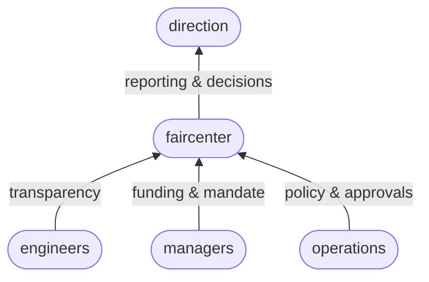
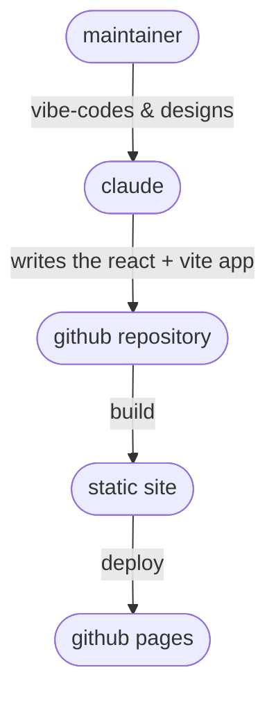

# faircenter
faircenter is a proof of concept for sharing GPU time across a research organisation with clear budgets, visible use, and allocation decisions people can stand behind. This is the short version of why it exists and how it is built. The manual, policy and strategy documents cover the detail. See Documentation below. Feel free to [get in touch](mailto:stephen.whitmarsh@proton.me) with questions or ideas.

## Why it exists
On a shared cluster with no allocation policy, access is first come first served, direction cannot see where the GPUs go, and a project cannot tell in advance whether the resources it needs will be free. The scheduler records raw usage after the fact, but nothing turns it into a picture the organisation can act on, so people over-ask, hold on to more than they need, or work around the queue, and the cluster runs flat out on the wrong work. faircenter turns use, budgets and requests into one shared, current picture, and gives each role the controls that close one of those gaps.

## Stakeholders
The app serves its stakeholders from the same facts. Engineers get an honest view of the cluster: whose jobs are running, how full it is through the week, and where their own work sits in the queue and why. Operations run the policy: the pools and budgets, the roll-out phase, the lane prices and priority weights, the capacity schedule, and the approvals, each staged and applied explicitly. The managers who fund the cluster set the mandate and the budget it works within. Direction reads that record as the few figures a decision rests on: the demand against the hardware, the projects heading over budget, and the reports that make the case for the next investment.

## Fit within the ecosystem
faircenter sits inside the tools an organisation already runs. People and projects come from Notion, it reads jobs and use from SLURM and writes budgets and reservations back, notifications go to the existing Slack channel with email as a fallback, and identity comes from single sign-on.

## How it is built and run
This is written in the first person, because I (Stephen Whitmarsh) design and direct it. I vibe-code it with Claude, which writes the React and Vite code, keeping the pace fast and the result easy for others to pick up later.

The proof of concept is a browser app in React and Vite, with charts in Recharts and hand-built SVG. It runs entirely in the browser on invented data at roughly the real scale of the organisation, around twenty teams and three hundred people, and a small simulated scheduler runs the generated demand, so it shows the whole scheme without touching a cluster. There is no backend in this repository. The manual describes the Django service and the SLURM adapter the live system needs.

Every push to `main` builds the static site and publishes it to GitHub Pages through the workflow in `.github/workflows/deploy.yml`, so the current demo is always a link away. To run it locally, work in the `frontend` directory: `npm install` once, then `npm run dev`.

## Documentation
The [manual](MANUAL.md) walks through the app tab by tab, with a technical appendix on the SLURM mapping and the data model. The [policy](POLICY.md) sets out how the app implements allocation: the two pools, budgets, the mechanisms and their parameters, and admission. The [strategy](STRATEGY.md) covers the direction over time, the phased rollout that moves budget from the person pool into teams, and the risks. [TODO.md](TODO.md) tracks the open points.

## Where it lives
- Repository: this repository.
- Demo: published to GitHub Pages under the `/faircenter/` path.
- Contact: stephen.whitmarsh@proton.me
- Licence: proprietary. No use, copying or distribution without written permission. See [LICENSE](LICENSE).
