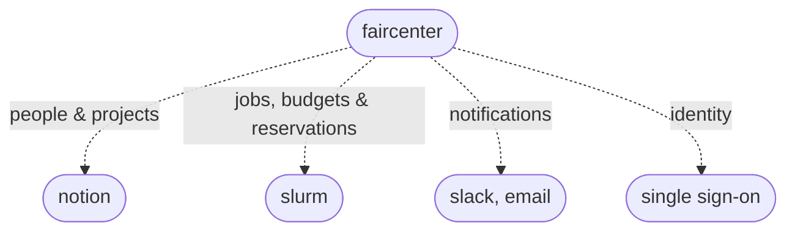

# faircenter
faircenter is a proof of concept application for fair and transparent sharing of GPU time across a research organisation or department.
For researchers, it ensures a clear view on their resource availability (budget) and policies, and the mechanisms to (de)prioritise work according to their needs.
For team leaders, it provides flexibility of resource allocation within their team's projects when needed.
For managers, it provides a clear overview of resource load over time, with the policy mechanisms and parameters to optimise usage against operational strategy, and support for signalling investment needs.
For executives, it provides a clear view and the ability to set priorities, timely summary statistics, and runway from hardware capacity to investment.

## Fit within the existing ecosystem
pfaircenter aims to interface with existing tools. E.g., People and projects are imported from Notion, SLURM implements scheduling and standing, and communication and done via slack. Identity is assumed to come from single sign-on.

## How it is built and run
faircenter is build by me using Claude for vibecoding in React and Vite, with charts in Recharts and hand-built SVG. It runs on invented data roughly at scale, with around 20 teams and 300 people. A small simulated scheduler is running generated demand, and creates synthetic data. Each push to `main` builds the static site and publishes it to GitHub Pages through `.github/workflows/deploy.yml`. To run it locally, work in the `frontend` directory: `npm install` once, then `npm run dev`. There is no backend to the application yet, with further imagined improvements described in [TODO.md](TODO.md), and build details in [BUILD.md](BUILD.md) which includes the imagines Django service and SLURM adapter. 

## Documentation
The [manual](MANUAL.md) walks through the app tab by tab. The [policy](POLICY.md) sets out the policies and parameters values, introducing a distribution of GPU "budget" across persons, teams and projects. [strategy](STRATEGY.md) explained how the policy could be phased in over time, anticipating a gradual organization twards team and project-oriented budgets, while minimizing administrative burden and maximizing both transparancy and decision-making at each level, and inclkudes a discussion of risks.

## Where it lives
- Demo: https://stephenwhitmarsh.github.io/faircenter/
- Code: https://github.com/stephenwhitmarsh/faircenter
- Contact: stephen.whitmarsh@proton.me
- Licence: proprietary. No use, copying or distribution without written permission. See [LICENSE](LICENSE).
