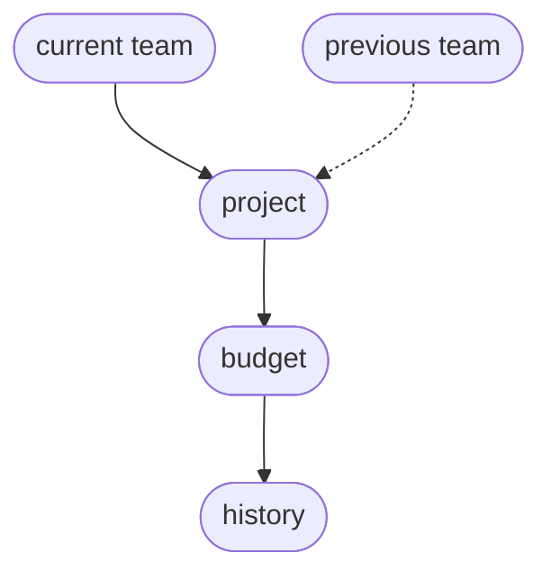

# Strategy

## What this addresses
Sharing GPU time across the organisation needs a few things a bare scheduler does not give: a way to decide who gets what, a shared view of who is using the cluster, a record of what was granted and used, and a way to weigh demand against the hardware. Without them, access is first come first served, direction cannot see where the GPUs go, a project cannot tell in advance whether the compute it needs will be free, and people over-ask, hold on to more than they need, or work around the queue.

Deciding who gets what does not scale as a single, central act. As the organisation grows, those decisions have to be shared out: to operations for capacity and cost, to team leads within their teams, to direction for priorities. Each of them can only decide well with the right information in front of them, current use, demand against the hardware, what is heading over budget, and what is waiting on an approval. Managing that split of decisions, and giving each decision-maker what they need, matters as much as the budgets themselves.

## The end state
The aim is a governed allocation the organisation can act on. Every team, project and person works within a budget, a share of GPU time over a period. Everyone can see use, budgets and reservations, and the rules behind them. Changes go through requests to a named approver. Each decision sits with whoever holds the information to make it, and the app gives them the figures to decide and to escalate. And most work has moved from individual use into funded team projects, with a small person pool kept for exploratory work.

## Phasing
The budgets and decisions come in over phases, each adding one constraint or handing over one decision, from measuring to bounding to pooling to delegating. Teams move through the phases one at a time rather than the whole organisation at once. Each phase is trialled with a few teams, and once it holds those teams move on and others follow, so a settled team can advance while a fast-moving one stays at an earlier phase.

The first phase adds no budgets. It measures what happens: whose jobs run, how the cluster fills through the week, and how long work waits. This record sizes every later phase.

The second phase gives each person a budget from the person pool, the first enforced limit, kept tight while most work is still individual, on the person pool. Urgent work can pay for a faster lane, but priority is otherwise flat, so the cluster shares evenly and budget size carries the weight.

The third phase hands each project a budget from its team's allocation and its planning to the project lead: requests, reservations and priority within that budget. The organisation's own projects gain higher priority, so the work it has singled out wins the busy moments. As work formalises the person pool's share falls and the teams pool grows to match.

The fourth phase hands each team its own pool, which the team lead divides across its projects and defends when the cluster is busy. Teams gain standing relative to one another, and a strong project can outrank a weaker one in a more favoured team.

---

## Risk assessment
The main risks to the scheme, and how the design handles them.

Organisational change is the largest risk. Staff, projects and teams change often, and a design tied to a fixed org chart would break at the first reorganisation. The project is the durable unit, carrying its own budget and history, so moving it between teams changes only where it reports, and splitting or merging a team re-points which projects belong where and leaves the projects untouched. Because most budget sits with projects and teams rather than individuals, someone leaving does not strand a project and someone joining draws on their project's budget at once. The stored history behind this is in the [manual](MANUAL.md).

Gaming and hoarding are to be expected, and neither pays off here. A budget is volume rather than priority: a large one lets a project run more over the period, but it does not move its jobs up the queue, since standing sets the order and the managers hold standing. Standing falls the more an account has used lately, so spending hard to get ahead pushes a project's own later jobs behind lighter users. The one way to turn budget into priority is to pay for a fast lane, which spends the budget faster. And because a budget is an entitlement, not reserved hardware, a large unused budget holds nothing back: the scheduler runs other work on the idle capacity.

Over-asking is caught when a budget is granted. Capacity is finite, so a large budget for one project leaves less for everyone else, and an approver who can see the whole pool and the priorities has to authorise it before it takes effect. Once the project is running, the analytics show its share of use against its priority, so a project drawing more than its rank warrants stands out and can be cut at the next review.

Because everyone can see how the app decides allocation, there is little room for quiet gaming, and the same factors steer behaviour: a cheaper off-hours `time-of-use weight` moves heavy work to the night, a higher rush `lane factor` discourages casual use of the fast lane, and the published `over-subscription factor` shows how fully the organisation commits its capacity.

The other risks are smaller, and each has a clear answer:

- Promising more than exists. The app checks every grant against real capacity through the commit limit, so the totals reconcile to the hardware available (see the [policy](POLICY.md)).
- Stale organisation data. The app keys to its own stable identifiers and falls back when a project or person is briefly unattached, so a Notion rename or a mid-reorganisation gap does not break allocation.
- Reliance on one scheduler. An adapter sits in front of the scheduler, so swapping SLURM for another changes nothing else.
- Stranded reservations. Reservations go only where a guaranteed slot is needed, and the app shows idle reserved time so it can be reclaimed.
- Weak adoption. The first stage needs no priority policy and no per-job approval, so the scheme is light to adopt, and the visibility it gives direction is the reason to keep using it.
