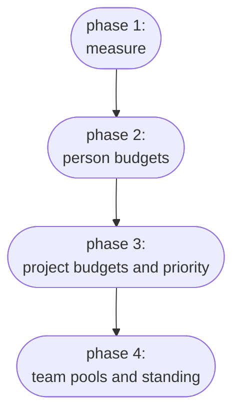

# Strategy

## What this addresses
A bare scheduler gives no way to decide who gets what, no shared view of use, no record of what was granted, and no way to weigh demand against the hardware. Without them, access is first come first served, and people over-ask, hold more than they need, or work around the queue.

Deciding who gets what does not scale as a single, central act. As the organisation grows, those decisions have to be shared out: to operations for capacity and cost, to team leads within their teams, to direction for priorities. Each can only decide well with the right figures in front of them: current use, demand against the hardware, what is heading over budget, and what is waiting on approval. Managing that split of decisions, and giving each decision-maker what they need, matters as much as the budgets.

## The end state
The aim is a governed allocation the organisation can act on. Every team, project and person works within a budget, a share of GPU time over a period. Everyone can see use, budgets, reservations and the rules behind them. Changes go through requests to a named approver. Each decision sits with whoever holds the information to make it, and the app gives them the figures to decide and to escalate. Most work has moved from individual use into funded team projects, with a small person pool kept for exploratory work.

## Phasing
The budgets and decisions come in over phases, each adding one constraint or handing over one decision. Teams move through the phases one at a time. Each phase is trialled with a few teams, and once it holds they move on and others follow, so a settled team can advance while a fast-moving one stays at an earlier phase.

The first phase adds no budgets. It measures what happens: whose jobs run, how the cluster fills through the week, and how long work waits. This record sizes every later phase.

The second phase gives each person a budget from the person pool. It is the first enforced limit, kept tight while most work is still individual. Urgent work can pay for a faster lane, but priority is otherwise flat, so the cluster shares evenly and budget size carries the weight.

The third phase gives each project a budget from its team's allocation and hands its planning to the project lead: requests, reservations and priority within that budget. The organisation's own projects gain higher priority, so the work it has singled out wins the busy moments. As work formalises, the person pool's share falls and the teams pool grows to match.

The fourth phase gives each team its own pool, which the team lead divides across its projects and defends when the cluster is busy. Teams gain standing relative to one another, and a strong project can outrank a weaker one in a more favoured team.

## Risk assessment

### Organisational change
Organisational change is the largest risk. Staff, projects and teams change often, and a design tied to a fixed org chart would break at the first reorganisation. The project is the durable unit, carrying its own budget and history, so moving it between teams changes only where it reports. Splitting or merging a team re-points which projects belong where and leaves the projects intact. Because most budget sits with projects and teams, someone leaving does not strand a project, and someone joining draws on their project's budget at once. [BUILD.md](BUILD.md) covers the stored history behind this.

### Gaming and hoarding
Gaming and hoarding do not pay off. A budget is a volume of GPU-time, not a place in the queue. A large one lets a project run more over the period but does not move its jobs up, since standing sets the order and the managers hold standing. Standing falls the more an account has used lately, so spending hard to get ahead pushes a project's own later jobs behind lighter users. The one way to turn budget into priority is to pay for a fast lane, which spends the budget faster. And because a budget is an entitlement and not reserved hardware, a large unused budget holds nothing back: the scheduler runs other work on the idle capacity.

### Over-asking
Over-asking is caught when a budget is granted. Capacity is finite, so a large budget leaves less for everyone else, and an approver who can see the whole pool and the priorities authorises it first. Once the project is running, the analytics show its share of use against its priority, so a project drawing more than its rank warrants stands out and can be cut at the next review.

### Transparency and incentives
Because everyone can see how the app allocates, there is little room for quiet gaming, and the same settings steer behaviour. A cheaper off-hours `time-of-use weight` moves heavy work to the night, a higher rush `lane factor` discourages casual use of the fast lane, and the published `over-subscription factor` shows how fully the organisation commits its capacity.

### Smaller risks
The smaller risks each have a clear answer:

- Promising more than exists. The app checks every grant against real capacity, so the totals reconcile to the hardware available (see the [policy](POLICY.md)).
- Stale organisation data. The app keys to its own stable identifiers and falls back when a project or person is briefly unattached, so a Notion rename or a mid-reorganisation gap does not break allocation.
- Reliance on one scheduler. An adapter sits in front of the scheduler, so swapping SLURM for another changes nothing else.
- Weak adoption. The first phase needs no priority policy and no per-job approval, so the scheme is light to adopt, and the visibility it gives direction is the reason to keep using it.
