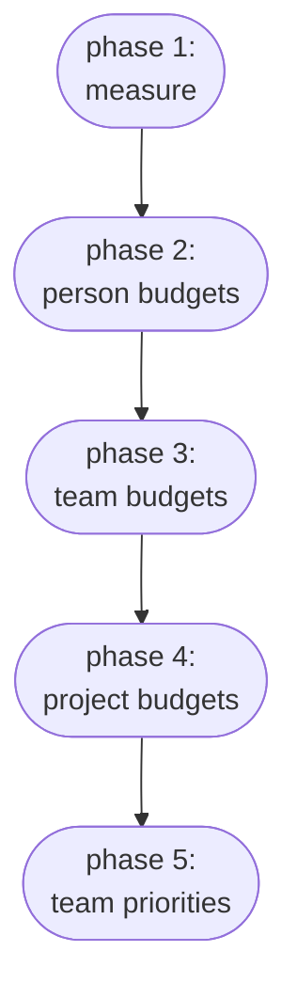
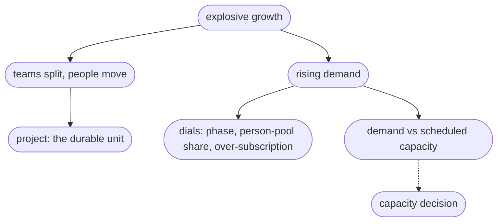

As the organisation grows, computational resources require decisions to be shared out: to operations for capacity and cost, to team leads within their teams, to direction for priorities. Each can only decide well with the right figures: current use, demand against the capacity, what or who is heading over budget, and what or who is waiting on approval. Managing that split of decisions, and giving each decision-maker what they need, is what the faircenter provides when placed within the strategy.
Second, best practices require a clear policy leverage, that can be tuned to an evolving context, while remaining transparent and fair. This would also require change, and change management, and careful rollout. The app provides this with a perspective of policy phases.

## The end state
The aim is a governed allocation the organisation can act on, with staff following practices that align with the priorities of the organization, and create a sense of fairneses between staff to uphold moral and allow planning and acceptance of limits and decisision.  Every team, project and person works within a budget, a share of GPU resources, either as a rate, or a summed budget (GPU-h). Changes to budgets and priorities are available - and expected - and go through requests to a named approver. Each decision sits with whoever holds the information to make it, and the app gives them the figures to decide and to escalate. It is expected that most work will move from individual use into team projects, with a small person pool kept for exploratory work.

## Phasing
The budgets come in over phases. For an engineer each phase opens a new place to draw budget from and adds the cap that comes with it, so a team gains a larger, shared source as it takes on more of its own planning. Teams move through the phases one at a time. Each phase is trialled with a few teams, and once it holds they move on and others follow, so a settled team can advance while a fast-moving one stays at an earlier phase.

- Phase 1 only **measures** what happens: whose jobs run, how the cluster fills through the week, and how long jobs wait in the cue.
- Phase 2 creates **individual budgets,** while keeping team budgets open. This is where sustained work moves off the person pool onto the team, run by the team lead as one coarse envelope. Priority lanes open, as well as the possibility to reserve GPUs.
- Phase 3 creates **team budgets** according to capacity and distribution.
- Phase 4 opens the possibility to define **project budgets** within the team pool. Its planning can also pass to the project lead, including requests, reservations and priorities within the budget.
- Phase 5 defines **team priorities**, so that in a stand-off a priority team takes the cluster. If needed, priorities can also be balanced with those of projects (to be implemented).

## Scalability
The organisation is growing in three ways at once: 
- more people and teams
- more demand on the cluster
- more hardware. 

The strategy and policy addresses the first two directly and informs the third.

Churn is where it helps most. Because allocation keys to the project rather than the org chart, and a project carries its own budget and history, teams can split and merge and people can move without stranding budgets, which matters when reorganisations come every few weeks. Governance load scales with the number of funded projects, not with headcount, since personal work is self-service and needs no approval, so a jump in people does not bring a matching jump in approvals.

Governance intensity tracks maturity rather than being fixed. The phasing is a ready escalation path, run light while contention is mild and turned up mechanism by mechanism as it bites, with a per-team override so a fast-growing team can move ahead of the rest. The person-pool share is a single dial operations lowers as sustained individual work formalises into projects, so growth is absorbed by informal work graduating into governed projects rather than by adding process everywhere.

The over-subscription factor scales throughput on fixed hardware. It sets how far committed budgets may exceed the GPU-hours the cluster offers, since projects rarely peak together and the scheduler absorbs the rest, and the admission check keeps total commitments reconciled to the hardware. Raised with evidence from realised use, it lets the same cluster carry more committed work, which buys time before the next purchase. Held below one, it keeps headroom for bursts.

When more hardware is the only answer, the resource outlook frames it: realised demand and committed entitlement against scheduled capacity, with a runway to the threshold, turning growth into a dated and quantified case for the next investment. The app allocates and reports. It does not schedule jobs, which is the scheduler's work, and it does not buy hardware.

## Risk assessment

### Organisational change
Organisational change is the largest risk. Staff, projects and teams change often, and a design tied to a fixed org chart would break at the first reorganisation. The project is the durable unit, carrying its own budget and history, so moving it between teams changes only where it reports. Splitting or merging a team re-points which projects belong where and leaves the projects intact. Because most budget sits with projects and teams, someone leaving does not strand a project, and someone joining draws on their project's budget at once. [BUILD.md](BUILD.md) covers the stored history behind this.

### Gaming and hoarding
Gaming and hoarding do not pay off. A budget is a volume of GPU-time, not a place in the queue. A large one lets a project run more over the period but does not move its jobs up, since standing sets the order and the managers hold standing. Standing falls the more an account has used lately, so spending hard to get ahead pushes a project's own later jobs behind lighter users. The one way to turn budget into priority is to pay for a fast lane, which spends the budget faster. And because a budget is an entitlement and not reserved hardware, a large unused budget holds nothing back: the scheduler runs other work on the idle capacity.

### Over-asking
Over-asking is caught when a budget is granted. Capacity is finite, so a large budget leaves less for everyone else, and an approver who can see the whole pool and the priorities authorises it first. Once the project is running, the analytics show its share of use against its priority, so a project drawing more than its rank warrants stands out and can be cut at the next review.

### Transparency and incentives
Because everyone can see how the app allocates, there is little room for quiet gaming, and the same settings steer behaviour. A cheaper off-hours `time-of-use weight` moves heavy work to the night, a higher rush `lane factor` discourages casual use of the fast lane, and the published `over-subscription factor` shows how fully the organisation commits its capacity.

### Planning burden
Compute for research is hard to predict, sometimes impossible, and holding an engineer to a budget set before a milestone adds overhead and harms morale for little gain. So the app keeps budgets preliminary. A budget is a rough envelope declared for planning, sized from recent use where there is history, and revised at a regular review. In phases that do not enforce it, it is a target to plan against, not a cap that stops jobs.

Introducing project budgets is left to each team leader rather than mandated by the organisation. A lead turns them on only when the team's work divides into projects that can be planned, and otherwise stays at team-level budgeting. This keeps the effort of estimating compute per project off teams whose research resists estimation, and limits the morale cost of strict self-declaration to the teams that have chosen it.

Budgets still do real work. They give each team and project a share of the cluster it can count on, not first-come-first-served. They let every commitment be checked against the hardware, so the organisation knows in advance whether a plan's resources will be there and when to buy more. And a budget is a volume rather than a rank, so it bounds spend without setting order: what runs first comes from the team's standing and the scheduler's fairshare. That lets a budget stay generous and coarse instead of tight and punitive.

Unpredictable work needs no plan at all. It runs in the person pool, with no budget, approval or reservation, and the first phase enforces nothing, showing only use, queues and waits. Operations adds only as much structure as growth demands, leaves teams to run their own work, and watches the total and its spread across teams rather than any one person's plan.

### Smaller risks
The smaller risks each have a clear answer:

- Promising more than exists. The app checks every grant against real capacity, so the totals reconcile to the hardware available (see the [policy](POLICY.md)).
- Stale organisation data. The app keys to its own stable identifiers and falls back when a project or person is briefly unattached, so a Notion rename or a mid-reorganisation gap does not break allocation.
- Reliance on one scheduler. An adapter sits in front of the scheduler, so swapping SLURM for another changes nothing else.
- Weak adoption. The first phase needs no priority policy and no per-job approval, so the scheme is light to adopt, and the visibility it gives direction is the reason to keep using it.
